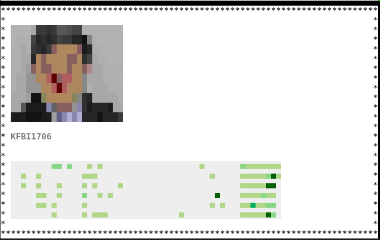

# daily-git

I've become obsessed with my github stats, why not view it from the commandline!

I'm well aware that node versions exists, but I avoid that when I can.

# TODOs
- [x] Show contribution count
- [x] Daily contribution stats*
- *[x] show calendar
- [ ] Stale project warning, 0 contributions today warning
- [ ] Update readme with tutorial on how to setup
- [x] handle screen resizing better
- [ ] Add a generic border and title function
  - [ ] Multi dimensional array with structs and info about size, border, title, which a wrapper function consumes
- [ ] Generic text display function
- [ ] daily, weekly, Monthly yearly trends
- [ ] pie charts, idea taken from the node versin of git-stats
- [ ] dark mode
- [x] 8 bit version of profile picture
- [ ] Stats for the current repo or the whole profile/org
- [ ] Time travel mode, showing the commits flying by and the Calendar being filled with green!
